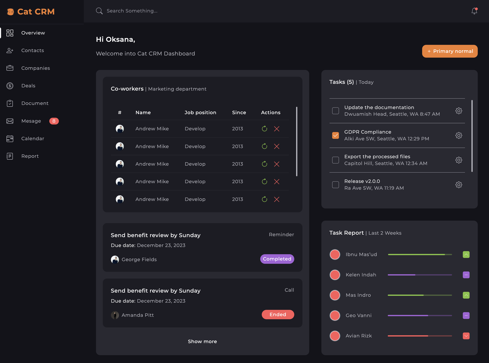

# Dashboard Styling Project

## Overview

This project is a dashboard that I styled according to a provided design mockup. The primary goal of this project was to learn and practice SASS (Syntactically Awesome Style Sheets).

## Features

- Responsive design
- Custom components styled with SASS
- Modern CSS techniques including Flexbox and Grid
- Use of variables, mixins, and functions in SASS
- Support for older browsers with fallback styles

## Learning Goals

- Understand the basics of SASS and how it extends CSS
- Practice writing cleaner and more maintainable CSS using SASS features like variables, nesting, mixins, and functions
- Learn how to structure SASS files for better project organization
- Gain experience with responsive design techniques

## License

This project is licensed under the MIT License - see the LICENSE file for details.
